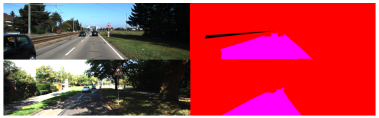
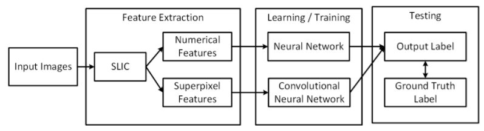
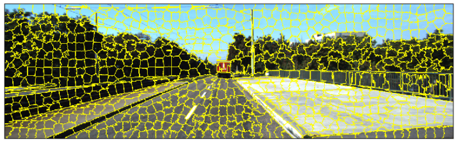
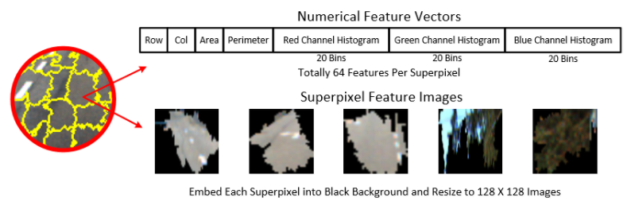
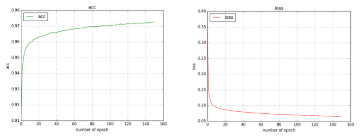
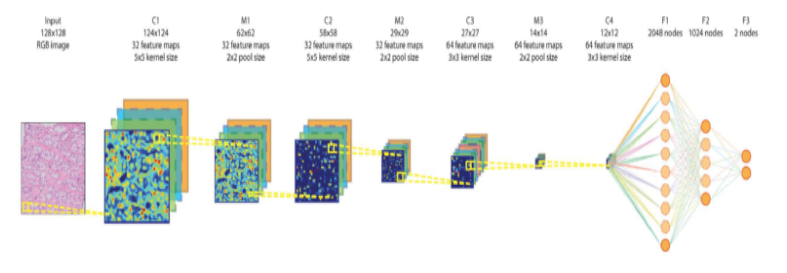
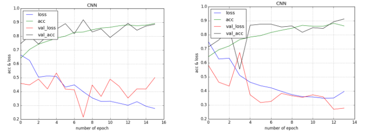
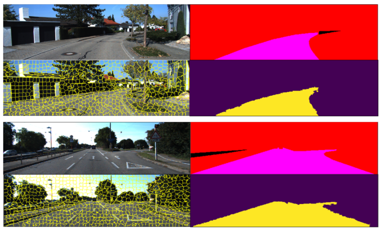

# CS 446 Machine Learning Final Project
# Road Boundary Detection via Machine Learning

    by Dongbo Wang, Bangqi Wang and Yibo Jiang

## Overview Video

## Introduction
Road boundary detection in image is a fundamental topic in SLAM and other applications. The main goal is to detect the region in the image that corresponds to the road area. Good road boundary detection results could help construct create map applications and driverless cars. While this topic is often directly related to the field of computer vision, the current algorithms might not work well when the images are made complicated with the presence of irregular elements like the vehicles and pedestrians on the road, shadows of the trees, etc. However, machine learning, especially deep learning, is a great tool to tackle problems like this. After experiencing with enough samples, the deep learning algorithm should be able to learn the key features of the road and find out the road area under complex environments.

Our project managed to combine the recent research results in computer vision and machine learning, namely SLIC and deep learning. Our basic strategy is to segment the image into superpixels first using SLIC and perform classification on each superpixel into road / nonroad using deep learning. We are able to achieve an average of 95% accuracy on the KITTI dataset.
  
## 2. Problem Statements

### 2.1 Problem Definition

As previously defined, road boundary detection is find the image regions that corresponds to the road area. This is a rather general definition since there are plenty of road types, each has its unique characters and surroundings. To limit our problem to a reasonable scale, our project is focusing on typical urban roads in the US.  We are using the “Road/Lane Detection Evaluation 2013” dataset provided by “The KITTI Vision Benchmark Suite”, which is limited to urban roads as shown in Figure 1. Still, we believe that with enough examples and time, our project should be able to deal with any types of roads. 

**Figure 1. Urban Road Image and Labeled Ground Truth Image**

This KITTI dataset, provides 289 urban road images paired with their labeled ground truth. Our goal is to learn a model that could take in an urban road image like the left ones and produce a labeled image like the right ones, the performance could be evaluated by comparing our resulting labeled image to the ground truth labeled image. It could be noticed that there is a black region in the top right ground truth image, that is the label for the purpose of other research and not part of our consideration. We only look at the purple region that is the road and consider all other regions as nonroad region.

### 2.2 Method Description

We consider our project as a common machine learning problem that consists of three major steps. First, we generate our dataset by extracting certain features from the image and assign a label to each example. Second, we apply the appropriate machine learning model, in our case, neural network and convolutional neural network from deep learning, and train the model with five fold validation. Finally, we applied the trained model to the test data and analyze its performance. The final stage of testing is straightforward and not much could be changed there, so we put lots of thoughts into the first two steps. For the first step of feature extraction, we implemented two different approaches, one is extract the numerical features into vectors and the other is to extract features as small images. For the second step, we applied different deep learning models to different feature types, neural network for numerical feature vectors and convolutional neural network for superpixel feature images. The general block diagram is shown in Figure 2.  We will explain more about the two approaches in the following sections. 

**Figure 2. Block Diagram**	

### 2.3 Input Images

There are a total of 289 images and each has one ground truth labeled image. The images are RGB images of size 1242 X 375 and the ground truth images are also RGB images with the same size. In the ground truth images, the road areas are purple with (R, G, B) = (255, 0, 255) and nonroad areas are either red with (R, G, B) = (255, 0, 0) or black with (R, G, B) = (0, 0, 0). So in practice, we only check the blue channel of the ground truth images and consider pixels with value 0 as nonroad and pixels with value 255 as road. For the five fold validation, we shuffle the 289 images randomly and separate them into five groups and create the folds by take one group as testing set and the other four groups as training set.

### 2.4 Feature Extraction

Detect the boundary of the road is not an usual image learning problem because instead of doing classification of each image, we are trying to learn about how to segment the image into road and nonroad regions. Intuitively, this problem is similar to the image segmentation problem of separating foreground and backgrounds. There are algorithms in the field of computer vision such as graph-cut algorithm and so on. There are not much learning involved in these algorithms except for some EM algorithm and they may not work very well when the foreground is complex, like the ‘noises’ on the road area. Therefore, we need something that could transform this image segmentation problem into some classification learning problem. Classifying every single pixel is certainly a bad idea, because a single pixel contains far less information than a group of pixels. So we think it would be better if we could cut the image into small regions and perform classification on these small regions. That’s why we used SLIC (Simple Linear Iterative Clustering) algorithm that could segment an image into small segments first without requiring any further knowledge about the image. SLIC is a widely used algorithm in computer vision for it is simple to implement, fast to run and easy to adapt to different images.

The basic idea is to group pixels into superpixels by the difference of color and distance. For each image, we specify the rough number of superpixels we want to get and SLIC will initialize the cluster centers evenly throughout the image. Then the algorithm makes several iterations, in each iteration, it assign pixels to the cluster center that has the nearest distance where the distance is a combination of color and spatial distance. Then the cluster center is updated to the average position of the cluster and small clusters got merged into larger once. After enough iterations, when the cluster center stop moving, stop the loop and output the result. There are several parameters that could be tuned for the algorithm but there is no standard criteria on what is a good parameter setting. So we only modify the parameters slightly different from the standard settings. With our setting, each image is segmented into roughly 800 superpixels and the superpixels adheres to the boundaries in the image naturally as shown in Figure 3. We want to make the superpixel boundaries adhere to the road boundary as much as possible because in that case the road region could be defined by a set of superpixels. Once we learn how to classify the superpixels into road and nonroad, we could put together all the superpixels inside the road region and then segment the image easily. 

**Figure 3. SLIC Superpixel Segmentation Result**

Once we have the superpixels, we only need to extract some feature from each superpixel to create a single example in our dataset. As mentioned before, we have two ways of extracting the features out of each superpixel as shown in figure 4.

**Figure 4. Feature Extraction**

To extract the numerical feature vector, we look at each superpixel and compute the following statistic results of that single region, including the centroid row and col index, the area and perimeter of the superpixel, the 20 bins histogram for each of the RGB channels. So each example has 64 features, encoding the geometric and color information of that superpixel. The final dataset consists of 208693 numerical feature vectors, including 166031 nonroad vectors and 42662 road vectors.

To extract the superpixel feature image, we cut out each superpixel, put them into a black background and resize the patch into a 128 X 128 image. We implement this method to take advantage of the convolutional neural network, for we have changed the segmentation problem into an image classification problem of each superpixel that naturally falls into CNN’s area of expertise. The final dataset consists of 208693 images. This size is too large so we use 2000 from each class to train.

To assign a label for each superpixel, we simply check whether the centroid of each superpixel is within the road region in the ground truth image.

However, there is some downside carried with this SLIC processing. For the superpixels might not adhere perfectly to the road boundaries. This will happen when the road boundary is ambiguous in the original image meaning that the gradient is not high enough to be detected by the algorithm. This will be a common issue for all boundary detection problem because if you cannot found the boundaries at the first place, there is no place for further detection. To address this problem, we tested the the SLIC performance by checking the area error between the labeled training images  and the ground truth images. It turns out that the SLIC will produce an average area error of 1.15%, meaning that there is a systematic error of around 1% carried to the final accuracy.

### 2.5 Training and Learning
For training and learning, we use several different methods for both numerical feature vectors and superpixel feature images. For each type of data, we construct a binary classifier to classify road and nonroad images. We tried Perceptron, Winnow, and Adagrad for numerical feature vectors. This section will only introduce methods with highest accuracy. We use neural network for numerical feature vectors and deep learning for superpixel feature images.

#### 2.5.1 Neural Network for Numerical Feature Vectors
For numerical feature vector, the neural network is the best classifier with over 97% accuracy. The neural network contains two hidden layers. First hidden layer has 256 nodes and the second hidden layer has 128 nodes. Figure 4 shows the layout for neural network.

Figure 5. Neural Network Layout

The neural network will use backpropagation to update weights for features and improve performance during the training process. We tried several parameters such as 512, 256, 128, and 64 nodes for hidden layers. Hidden layer with 256 nodes gets the highest accuracy, over 97%. 

Figure 6. Training Accuracy & Loss for Neural Network

#### 2.5.2 Superpixel Feature Images
We use deep learning convolutional neural network as a binary classifier for superpixel feature images. 
Due to the time constraints and computing power limitation, we use 2000 nonroad images and 2000 road images as training dataset. We design our deep learning neural network based on a deep learning neural network for breast cancer diagnosis [1]. Our deep learning neural network has four convolution layer, four max-pooling layers, and ReLu between convolutional layers and max-pooling layers. We test two different layouts with 2048 and 256 nodes in fully connected layers. Figure 6 shows the neural network layout. 

Figure 7. Deep Learning Neural Network Layout

For deep learning training, each epoch cost about 430 seconds. We terminate the training process when there is a harbinger of overfitting. According to the training and validation curves in figure 6, deep learning neural network can achieve accuracy over 90%. If we could have more time, we can train the neural network on larger dataset, adjust parameters for better performance, and modify neural network layouts. 

Figure 8. Accuracy & Loss for Deep Learning

### 2.6 Testing
For testing, we perform the similar procedure as before. First, we perform SLIC to each test image to segment the image into superpixels. Second, we extract the features as specified before, either into numerical feature vectors or superpixel feature images. Then, we use the trained model to classify each superpixel into road or nonroad category. Finally, we produce a labeled image and compare the labeled image with the ground truth label image for evaluation. We are using the area to measure the accuracy. 

## 3. Results and Evaluation
### 3.1 Visualized Detection Result

Figure 9. Exemplary Visualized Detection Results

